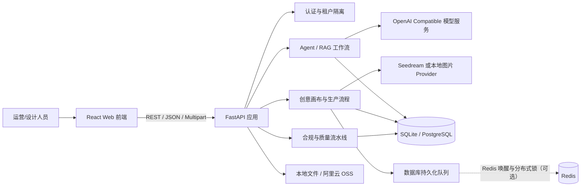

# 技术架构说明

> 基线：2026-08-22 当前仓库代码。本文回答“系统用了什么技术、各部分如何协作”。功能范围见 [02-FEATURES.md](./02-FEATURES.md)，代码链路见 [03-IMPLEMENTATION-GUIDE.md](./03-IMPLEMENTATION-GUIDE.md)。

## 1. 系统定位

Enrui AI Commerce Agent 是面向电商团队的 AI 商品内容生产平台。系统把商品事实、品牌资料、设计规范和商品图片组织成可检索上下文，再通过文本/视觉模型生成详情页文案与图片，并提供画布编排、分镜生产、质量检查、人工审核、版本恢复和批量生产。

系统有两种运行形态：

- 本地演示：SQLite、本地文件、Mock LLM/Embedding、本地 Pillow 图片渲染，无外部模型也能跑通主要流程。
- 线上部署：PostgreSQL、Redis、阿里云 OSS、OpenAI Compatible 文本/视觉/Embedding 接口，以及火山方舟 Seedream 图片生成接口。

## 2. 总体架构

前端只通过 `/api` 访问后端。开发环境由 Vite 代理请求，容器环境由 Nginx 托管静态文件并反向代理后端。

## 3. 技术栈

### 前端

| 技术 | 用途 |
| --- | --- |
| React 19 + TypeScript 5.7 | 页面、组件和类型约束 |
| Vite 6 | 开发服务器与生产构建 |
| React Router 7 | 页面路由 |
| Axios | REST 请求、Token 注入和错误处理 |
| Tailwind CSS 4 | 样式系统 |
| React Flow | 节点式创意画布 |
| Konva / React Konva | 图片蒙版、保护区域和局部编辑 |
| React Markdown + remark-gfm | 详情页 Markdown 预览 |
| Lucide React | 图标 |

主入口是 `frontend/src/App.tsx`，API 封装在 `frontend/src/api/client.ts`，跨页面类型在 `frontend/src/types/index.ts`。

### 后端

| 技术 | 用途 |
| --- | --- |
| Python 3.11、FastAPI、Uvicorn | REST API、上传、后台任务、OpenAPI |
| Pydantic 2 / pydantic-settings | API 模型和环境配置 |
| SQLAlchemy 2 | ORM、SQLite/PostgreSQL 适配和连接池 |
| OpenAI Python SDK | Compatible Chat、Vision、Embedding |
| httpx | 图片模型、多模态向量及其他 HTTP 调用 |
| NumPy | RAG 余弦相似度 |
| Pillow | 本地演示图、模板渲染、后处理和拼图 |
| pypdf / python-docx | PDF、DOCX 解析 |
| psycopg、redis-py、oss2 | PostgreSQL、Redis、阿里云 OSS |

### 部署

- `docker-compose.yml`：前后端两个容器，后端健康后启动前端。
- `backend/Dockerfile`：Python 3.11、Noto CJK 字体、Uvicorn。
- `frontend/Dockerfile`：Node 22 构建，Nginx 1.27 托管。
- `deploy/nginx.conf`：SPA fallback、API 代理、30 MB 上传限制和 300 秒超时。
- `deploy/.env.production.example`：生产依赖配置模板。

## 4. 后端分层

| 目录 | 职责 |
| --- | --- |
| `backend/app/api/` | HTTP 路由、鉴权、参数校验和用例编排 |
| `backend/app/agents/` | 商品理解、消费者分析、营销策略、详情页生成和编辑 Agent |
| `backend/app/rag/` | 切片、Embedding、向量/关键词检索、上下文组装 |
| `backend/app/services/` | LLM、图片、存储、队列、合规、质量、渲染和设计学习 |
| `backend/app/models/` | SQLAlchemy 模型 |
| `backend/app/schemas/` | Pydantic 请求/响应模型 |
| `backend/app/config.py` | 环境变量和默认值 |
| `backend/app/main.py` | 应用组装、审计中间件、生命周期和健康检查 |

## 5. 核心数据域

1. 账号隔离：`Tenant`、`User`、`TenantMember`。
2. 商品知识：`Product`、`ProductAsset`、`ProductFact`、`KnowledgeDocument`、`KnowledgeChunk`、`BrandVisualProfile`。
3. 详情页生成：`Generation`、`EditHistory`、`ImageReview`、`LearnedDesignProfile`、`SkillCandidate`、`DesignSkill`、`DesignSkillVersion`。
4. 创意生产：`CreativeProject`、`CreativePlan`、`StoryboardModule`、`CanvasNode`、`CreativeGeneration`、`CreativeBatchJob`、`CreativeFeedback`、`DetailPageTemplate`。
5. 质量审核：`ApprovalIssue`、`QualityRegressionRun`、`QualityRuleSet`、`QualityRuleVersion`、`QualityFeedback`、`RegressionSample`、`ProjectReview`、`ProjectSnapshot`。
6. 生产运维：`ProductionQueueTask`、`SkuBatch`、`SkuBatchItem`、`AuditLog`、`ProviderBillingRecord`。

大多数业务数据包含 `tenant_id`。新增查询或写入时必须带当前登录租户条件，不能只按自增 ID 查询。

## 6. AI、RAG 与图片能力

文本能力由 `LLMClient` 统一封装：普通对话、JSON 输出、最多 6 图的 Vision、标准/多模态 Embedding。JSON mode 失败时会追加纯 JSON 提示并尝试从代码块提取。Mock 模式返回确定性结构化结果和本地向量，便于无模型开发。

RAG 链路是：文档解析 → 约 500 字切片并保留重叠 → Embedding → 保存 `KnowledgeChunk` → 按商品/品牌/全局范围召回 → 余弦排序。Embedding 不可用时回退关键词检索。

图片能力通过 Provider 替换：有模型配置时调用 Seedream；否则用 Pillow 排版参考商品图完成流程演示。任务类型还可以路由到商品、人物、编辑、放大等不同模型。

## 7. 存储、任务与可观测性

- `StorageService` 统一本地文件和 OSS。本地返回 `/uploads/...`；OSS 返回对象代理地址，读取时生成 15 分钟签名 URL，并在临时目录缓存处理文件。
- 普通详情页生成使用 FastAPI `BackgroundTasks`，适合本地和单实例轻任务。
- SKU/整页生产使用数据库持久化队列和进程内 Worker；Redis 可负责唤醒与跨实例锁。任务支持优先级、进度、取消、重试和服务重启恢复。
- `/api/health` 返回模型、Embedding、数据库、Redis、存储状态。
- API 审计中间件生成/透传 `x-request-id`，把状态码和耗时写入 `AuditLog`。

## 8. 安全与当前边界

- 密码使用 PBKDF2-HMAC-SHA256、随机 Salt、200,000 次迭代。
- Access Token 是含用户、租户和过期时间的 HMAC 签名载荷，不是标准 JWT。
- 生产必须替换 `AUTH_SECRET`、关闭 Mock、启用 PostgreSQL并妥善管理密钥。
- 当前 CORS 为 `*`，生产应限制为实际前端域名。
- 部分早期生成接口尚未统一注入认证或租户过滤；正式多租户上线前必须完成全路由审计。
- SQLite 通过启动时 `create_all` 和少量 `ALTER TABLE` 兼容历史数据；生产 PostgreSQL 尚无 Alembic，建议尽快补迁移体系。
- 进程内 BackgroundTasks/Worker 不等价于独立任务平台；高并发或多副本部署应迁移到专用队列 Worker。

