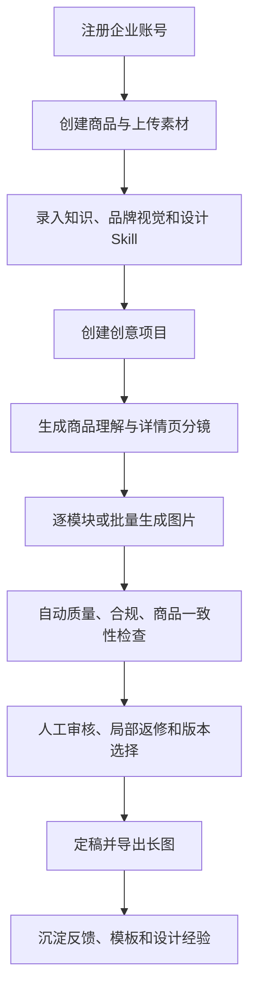

# 功能说明

> 本文按用户可见能力说明“系统现在能做什么”。实现入口见 [03-IMPLEMENTATION-GUIDE.md](./03-IMPLEMENTATION-GUIDE.md)。

## 1. 推荐业务流程

## 2. 账号与工作台

- 注册时同时创建企业租户和 Owner 账号；登录后用 Bearer Token 识别用户、企业和角色。
- Dashboard 展示商品、生成记录、成功率等概览。
- API 请求带请求 ID，并记录状态码和耗时。

## 3. 商品与素材管理

- 商品的创建、查看、编辑、删除，以及名称、品类、价格、品牌、描述、目标人群、成分、用法和规格维护。
- 上传商品主图、详情图和业务素材，并维护用途、优先级、标签等元数据。
- 自动生成或手工编辑前景蒙版。
- 识别 Logo、包装文字等保护区域，生成后尽量恢复受保护内容。
- 商品事实可抽取、编辑、确认，用作生成和合规检查依据。
- Readiness 与图片准入检查可提前发现资料不完整或图片不合格。

## 4. 知识库与 RAG

- 直接录入文本，或上传 PDF、DOCX、TXT、Markdown、CSV、JSON。
- 知识可绑定商品，也可按品牌或全局使用。
- 上传后自动解析、切片、向量化；生成时召回商品、品牌和全局上下文。
- 无真实 Embedding 服务时使用 Mock 或回退关键词检索。

适合录入产品说明书、成分报告、检测证书、品牌规范、售后政策和合规用语。

## 5. AI 详情页文案生成

- 输入包含商品信息、图片、RAG 结果、品牌规则、设计 Skill 和历史学习结果。
- 串行执行商品理解、消费者分析、营销策略和详情页生成。
- 输出标题、卖点、优势、场景、痛点方案、购买理由、FAQ、售后、营销文案和主图文案。
- 保存阶段执行轨迹和耗时，页面可轮询进度。
- 自动检查缺失模块、商品事实覆盖和高风险夸大表达。
- 支持单模块重生成、语气优化、受众切换、Markdown 手工编辑和模块排序。
- 支持失败重试、编辑历史和 Markdown 导出。

## 6. 品牌视觉与设计 Skill

- 维护品牌 Logo、主色、强调色、字体、视觉关键词、禁用元素和语气。
- Skill 可按通用、品类、品牌或商品四级作用域配置，包含设计原则、模块指导、视觉/文案/负面规则。
- Skill 修改保留版本，可回滚。
- 系统根据图片评价和创意反馈更新品牌/品类学习画像。
- 样本量与置信度满足条件时生成候选 Skill，由人工编辑、发布或拒绝。

## 7. 创意项目与节点画布

- 基于商品创建指定平台和尺寸的创意项目。
- 在 React Flow 画布中管理素材、生成结果和父子版本关系，保存节点布局与视口。
- 从已选节点生成多个版本，也可自动选择商品素材。
- 支持构图、场景、颜色、模特、灯光等变化轴。
- 支持严格、平衡、创意三种商品锁定程度和预览/终稿阶段。
- 支持精修稿、交付稿上传、节点评价和最终版本标记。
- 保存 Provider、模型、参数、耗时、成本、上下文和错误信息。

## 8. 详情页策划与分镜生产

- AI 先生成商品理解、内容策略和有序分镜模块。
- 可编辑模块标题、目标、内容指导、视觉方向、生产方式和必选状态。
- 每个模块可生成多个版本，再选择预览或审核通过版本。
- 快速编辑支持替换图片、标题/副标题、缩放、偏移、文字位置、字号、颜色、对齐和底色。
- 批量生成整套分镜，显示总数、成功数、失败数和当前模块，并可停止。
- 套用整套风格参数并保留可回滚版本。
- 高清定稿、精修回传、交付提交和最终版本标记形成交付闭环。

## 9. 质量、合规与审核

- 文案合规：基于知识来源识别无依据功效、绝对化表述等风险。
- 视觉规则：检查分辨率、重复图和模块完整度等确定性指标。
- Vision 审核：检查商品、品牌和商业可用性。
- 商品一致性：对比参考图与输出图中的包装、Logo、文字和结构。
- 质量驱动重试：把失败指标转成修复指令重新生成。
- 人工驳回可记录问题类型、严重度、动作、备注和矩形区域；局部重生成后合回原图。
- 品类质量规则支持保存、版本管理和回滚。
- 维护回归样本并运行质量回归，质量工作台聚合待审核事项与评论。

## 10. 模板、快照和复用

- 将项目保存为详情页模板，把商品名、品牌、规格等参数化后应用到新商品。
- 模板记录使用次数，可查看推荐和历史表现。
- 项目可生成版本快照、比较差异、恢复历史版本，并可复制项目。

## 11. 批量生产与任务中心

- 预览 CSV/批量输入映射，导入多个 SKU 任务。
- 每个 SKU 对应持久化队列任务，可查看等待、运行、完成、失败和取消状态。
- 单项可重试，任务可取消；Worker 按优先级取任务，失败在最大次数内重新排队。
- 服务重启后，运行中的持久化任务恢复为待处理。
- 生产 Dashboard 展示吞吐、平均生产/首次可审/定稿时间、审核轮次和一次通过率。

## 12. 导出与交付

- 传统详情页结果可导出 Markdown。
- 分镜项目按模块顺序拼接成长图。
- 导出前检查必选模块、合规和质量风险；有风险时需显式确认。
- 交付文件可存本地或 OSS。

## 13. 当前限制

- Mock 文案和本地 Pillow 合成图片用于演示流程，不代表真实生产质量。
- 自动测试目前主要覆盖模板变量、快照差异、生成控制、商品蒙版和品类质量规则，端到端覆盖仍需补充。
- 系统存在“传统生成编辑器”和“创意分镜生产”两套路径；新业务建议优先使用创意项目 + 分镜路径。

