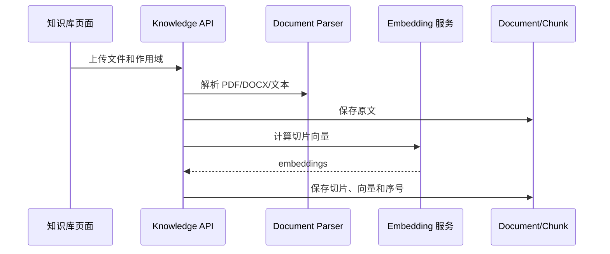
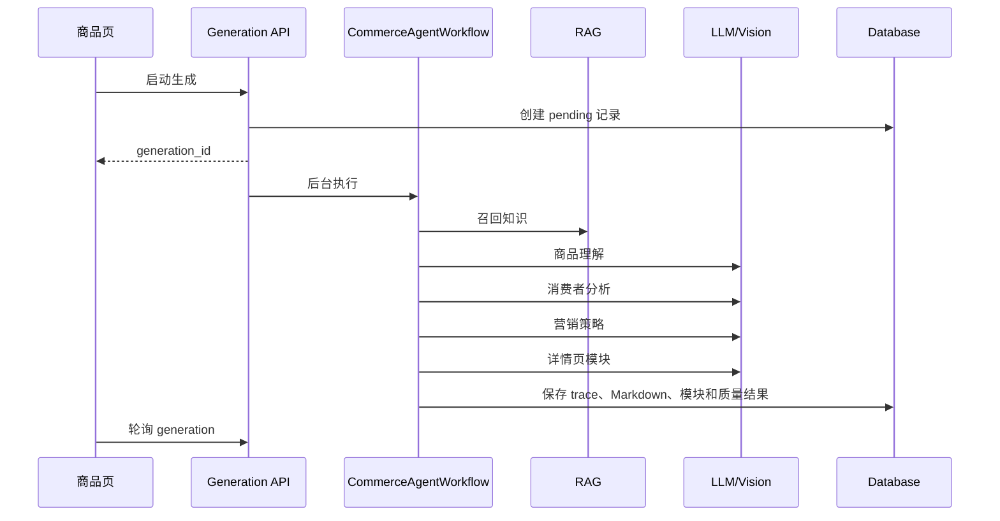

# 功能实现与开发指南

> 面向接手代码的开发同事，说明主要入口、数据流和扩展方式。整体背景见 [01-TECHNICAL-ARCHITECTURE.md](./01-TECHNICAL-ARCHITECTURE.md)。

## 1. 推荐阅读顺序

1. `backend/app/config.py`：运行模式和外部依赖开关。
2. `backend/app/main.py`：路由、审计中间件和生命周期。
3. `backend/app/models/__init__.py`：实际保存的数据。
4. `backend/app/schemas/__init__.py`：API 输入输出结构。
5. `frontend/src/App.tsx`：用户可访问页面。
6. `frontend/src/api/client.ts`：页面与后端接口映射。

调试后端可访问 `/docs` 查看 OpenAPI，通过 `/api/health` 检查运行状态。

## 2. 请求、认证与租户隔离

登录后，前端 Axios 把 Access Token 放入 `Authorization: Bearer ...`。后端 `current_auth` 验证 HMAC 签名、过期时间、有效用户和租户成员关系，最后提供 `AuthContext`。

业务接口应始终同时按对象 ID 和租户过滤：

```python
def handler(db: Session = Depends(get_db), auth: AuthContext = Depends(current_auth)):
    row = db.query(Model).filter(
        Model.id == target_id,
        Model.tenant_id == auth.tenant_id,
    ).first()
```

创建租户数据时写入 `tenant_id=auth.tenant_id`。不要相信前端传入的租户 ID。

## 3. 商品与素材

入口：`backend/app/api/products.py`；前端：`ProductCreate.tsx`、`ProductDetail.tsx`。

商品保存结构化事实，图片和其他素材保存为 `ProductAsset`，文件由 `StorageService` 管理。素材可生成前景蒙版和保护区域。生成后，`image_postprocess.py` 能硬锁商品主体、恢复保护区域、局部合成、计算感知相似度、检测重复图和生成联系表。

## 4. 知识库与 RAG

入口：`backend/app/api/knowledge.py`、`backend/app/rag/__init__.py`。



召回时先确定商品、品牌、全局允许范围，再为查询计算向量并做余弦排序；向量不可用时按关键词命中排序。命中的标题、作用域和正文拼成模型上下文。

新增文档格式时扩展 `document_parser.py`；接入外部向量库时，尽量保持 `index_document` 和 `retrieve_context_with_hits` 的语义不变。

## 5. 传统详情页 Agent 工作流

入口：`backend/app/api/generations.py`、`backend/app/agents/__init__.py`。

`POST /api/products/{id}/generate` 创建 `Generation(pending)`，再由 BackgroundTasks 执行 `_run_workflow`：



工作流同时匹配设计 Skill 和学习画像，调用 `visual_renderer.py` 生成预览模块。异常会标记 `failed`；重试要求 `attempt_count < max_attempts`。编辑由 `DetailEditorService` 完成，更新后重新生成 Markdown、运行质量校验并写入 `EditHistory`。

## 6. 创意画布与图片生成

入口：`backend/app/api/creative.py`；前端：`CreativeCanvas.tsx`。

一个 `CreativeProject` 拥有多个 `CanvasNode`，生成节点用 `parent_node_id` 形成版本树；每次模型调用另存 `CreativeGeneration` 以便追踪。

生成处理顺序：

1. 校验项目和素材归属。
2. 自动选择商品素材，或使用用户选中节点。
3. 加载商品事实、品牌视觉、设计 Skill、质量规则和保护信息。
4. `validate_and_rewrite_prompt` 补齐事实约束。
5. `apply_generation_controls` 注入商品锁定、变化轴和生成阶段要求。
6. `get_image_provider(task_type)` 选择图片服务。
7. 保存输出，必要时执行主体硬锁、保护区域恢复或局部合成。
8. 创建画布节点，保存上下文、成本和错误诊断。

Provider 边界位于 `services/image_generation.py`：有配置时调用 Seedream `/images/generations`；无配置时由 Pillow 本地合成。接入新供应商时实现相同的 `generate(...) -> list[str]` 接口，并在 `get_image_provider` 中选择。

## 7. 策划、分镜与导出

入口：`creative.py` 的 `/plan`、`/plan/modules`、`/batch-generate`、`/export`；前端：`Storyboard.tsx`。

系统先产生 `CreativePlan`，再落库一组有序的 `StoryboardModule`。模块保存目标、内容指导、视觉方向、生产方法和必选标记。候选图片仍保存为 `CanvasNode`，模块只引用选中的预览/最终节点，因此版本树和模块排序互不干扰。

单项目批量用 `CreativeBatchJob`；多 SKU 生产用 `ProductionQueueTask` + `SkuBatch`。导出时按模块顺序读取最终或预览节点，检查缺失模块和风险，再通过 Pillow 拼成长图并返回存储 URL。

## 8. 质量与合规

| 层 | 实现 | 作用 |
| --- | --- | --- |
| Prompt 前置 | `quality_pipeline.py` | 注入事实、商品锁定和变化范围 |
| 确定性检查 | `visual_quality.py`、`image_postprocess.py` | 尺寸、重复、完整性、相似度 |
| 视觉模型检查 | `vision_quality.py`、`product_consistency.py` | 商业质量及包装/Logo/文字一致性 |
| 业务合规 | `compliance.py` | 对照事实和知识来源检查声明风险 |

质量不通过时，`repair_instruction` 生成修复提示，`retry-by-quality` 创建新版本。人工问题保存在 `ApprovalIssue`，可带矩形区域；局部生成后由 `regional_composite` 羽化合回原图。

品类规则保存在 `QualityRuleSet`，修改产生 `QualityRuleVersion`。`RegressionSample` 和 `QualityRegressionRun` 用于比较规则或模型升级前后效果。

## 9. 反馈学习

图片和节点反馈分别写入 `ImageReview`、`CreativeFeedback`。后台按品牌 + 品类重建 `LearnedDesignProfile`，统计正负样本、置信度和高频规律。稳定画像可生成 `SkillCandidate`，必须人工发布后才成为 `DesignSkill`，避免学习结果直接污染生产 Prompt。Skill 修改前保留版本，可回滚。

## 10. 持久化生产队列

`services/production_queue.py` 在应用启动时开启守护线程：

1. 将服务中断前的 `running` 任务恢复为 `pending`。
2. 按优先级降序、创建时间升序取任务。
3. 有 Redis 时获取任务锁；无 Redis 时本进程执行。
4. 生成 Plan 并逐模块生产，持续更新进度。
5. 模块之间检查取消标记。
6. 失败且未超过次数时重新排队，否则标记失败并更新批次。

Redis 是协调层，任务状态以数据库为准。

## 11. 本地开发与验证

```bash
./start-backend.sh
./start-frontend.sh
```

```bash
cd backend
.venv/bin/python -m unittest discover -s tests

cd ../frontend
npm run build
```

本地默认 `LLM_MOCK_MODE=true`。验证真实模型时复制 `backend/.env.example` 为 `backend/.env` 并填写 Key，密钥文件不得提交。

## 12. 开发约定

- 新表继承 `Base`；业务表默认加入 `tenant_id`，并补充 Pydantic Schema。
- 新接口放到对应 router，注入 `current_auth`，对所有对象做租户过滤。
- 新页面在 `App.tsx` 注册路由，在 `api/client.ts` 封装请求，在 `types/index.ts` 定义类型。
- 新模型供应商通过 Service/Provider 适配，不在路由中散落请求代码。
- 新生成参数要保存到上下文/参数快照，保证结果可追溯。
- 新质量规则优先实现确定性检查，再决定是否调用 Vision LLM。
- 数据结构变更应先引入 Alembic，并提供可回滚迁移。
- 测试至少覆盖正常路径、租户越权、模型失败、重试/取消和重启恢复。

## 13. 已知技术债与优先级

1. 统一早期 products/generations 路由的认证和 `tenant_id` 过滤。
2. 引入 Alembic，停止依赖启动时临时补列。
3. 将 BackgroundTasks 和进程内线程迁移为独立 Worker，并定义任务幂等键。
4. 增加 API 集成测试与前端关键流程测试。
5. 限制生产 CORS，补角色权限矩阵、Token 吊销/刷新和登录限流。
6. 为模型调用增加统一 tracing、费用统计、分层超时和熔断。
7. 拆分较大的 `creative.py` 和 `models/__init__.py`，将用例逻辑下沉到 service。

