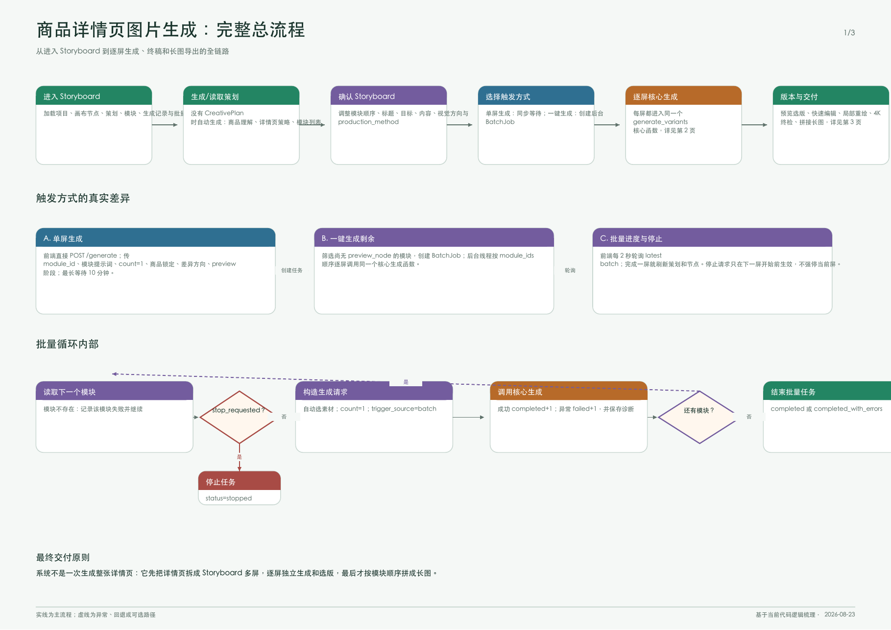
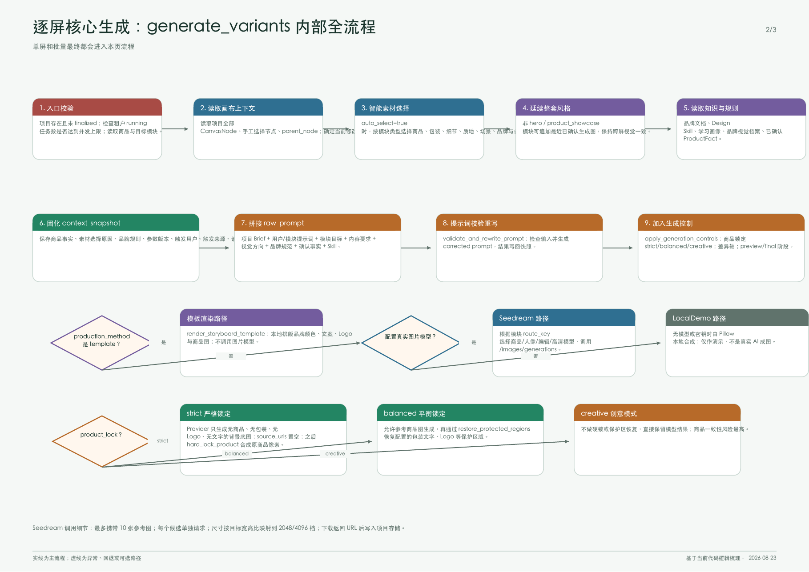
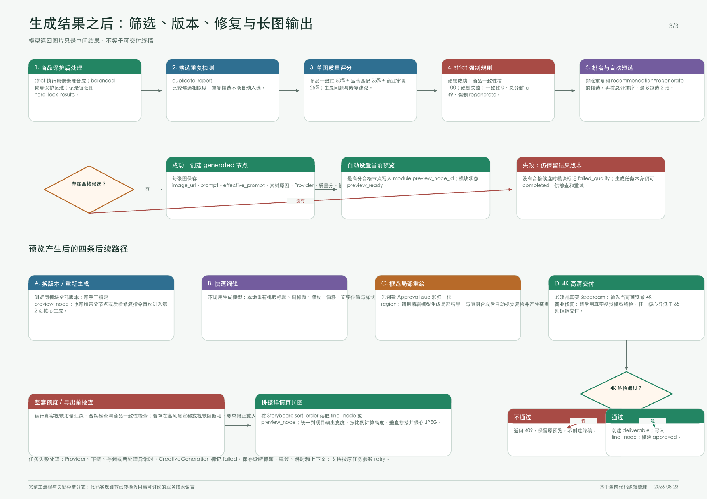

# 业务流程图索引

本目录集中保存项目的业务与技术流程图，方便产品、运营、设计和研发使用同一份流程说明。流程图文件统一放在 `docs/diagrams/`，不再散落在项目根目录、`output/` 或临时目录中。

## 商品详情页图片生成

### 推荐查看方式

- 需要转发、打印或完整阅读时，查看 [完整流程 PDF](diagrams/product-detail-image-generation/complete-flow.pdf)。
- 需要在聊天、需求文档或评审记录中引用时，使用下面三张分页 PNG。

### 第 1 页：全链路总览

覆盖内容：

- 进入 Storyboard、读取或生成策划；
- 确认模块与选择生成入口；
- 单屏生成和批量生成的差异；
- 批量任务的串行处理、停止和失败记录；
- 从逐屏生成到版本交付的整体关系。

### 第 2 页：逐屏生成核心

覆盖内容：

- 入口校验、画布上下文和智能素材选择；
- 品牌资料、商品事实、Design Skill 和学习画像；
- Prompt 拼接、校验重写与生成控制；
- 模板渲染、Seedream 和 LocalDemo 三条生产路径；
- `strict`、`balanced`、`creative` 三种商品锁定方式。

### 第 3 页：质量、版本与交付

覆盖内容：

- 商品保护后处理、候选去重和质量评分；
- 合格候选排名、自动短选和 `failed_quality`；
- 换版本、快速编辑、框选局部重绘；
- 4K 高清修复与真实视觉模型终检；
- 合规检查、商品一致性检查和详情页长图拼接。

## 阅读约定

- 实线表示主流程。
- 虚线表示异常、回退或可选路径。
- “自动短选”是系统质量判断，不等于用户偏好反馈。
- 详情页不是一次生成整张长图，而是逐屏生成、逐屏选版，最后按 Storyboard 顺序拼接。

## 维护约定

流程发生变化时，应同步更新：

1. `complete-flow.pdf`；
2. 对应分页 PNG；
3. 本文档中的覆盖内容说明；
4. 如涉及接口或核心服务，再同步更新 `03-IMPLEMENTATION-GUIDE.md`。

不要将渲染过程中的临时脚本、重复截图、缓存文件或 `.DS_Store` 提交到流程图目录。
